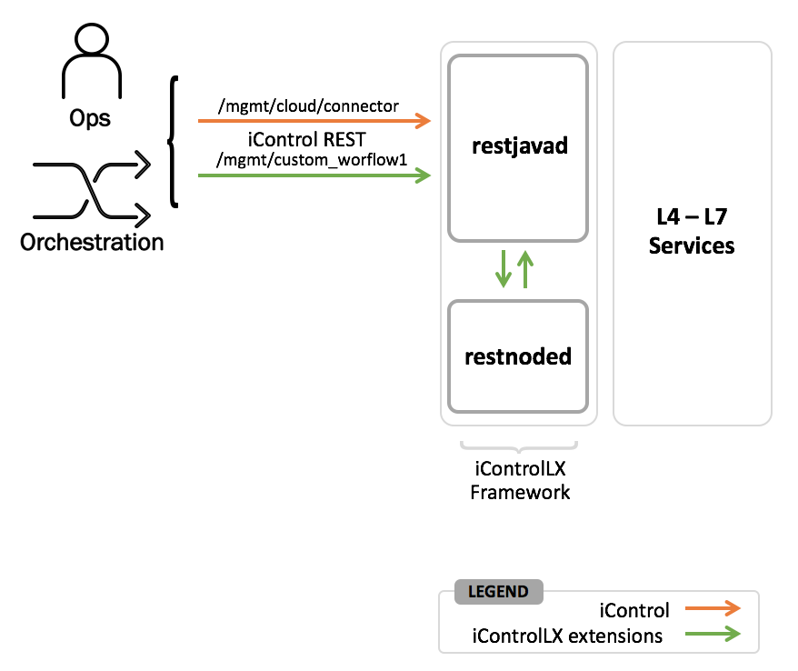

Lab 1.1 - The Daemons
---------------------

Understand the Two Primary Daemons
^^^^^^^^^^^^^^^^^^^^^^^^^^^^^^^^^^

When developing iControl LX Extensions, there are two daemons to be aware of:

- ``restjavad``
- ``restnoded``

``restjavad`` presents the F5 iControl REST API, the interface to the BIG-IP platform.

``restnoded`` presents services for developing iControl LX Extensions, in
addition to acting as the interface to ``restjavad`` and the iControl REST API.

.. NOTE:: In the diagram above, the orange line represents an iControl REST
   resource that ships with the BIG-IP platform. The green line
   represents a REST call to a custom iControl LX Extension.

Task 1 - Start/Stop/Restart the Daemons
^^^^^^^^^^^^^^^^^^^^^^^^^^^^^^^^^^^^^^^

Perform the following steps to complete this task:

#. Connect via SSH to your BIG-IP platform (a shortcut already exists in
   PuTTY - ``10.1.1.245``, ``root/default``). Execute the following:

   ``bigstart status restnoded``

   Example output:

   .. code::

      $ bigstart status restnoded
      restnoded    run (pid 6209) 40 days

   .. NOTE:: You can specify multiple daemons with the ``bigstart`` command. For
      example, the following will get the status of both 'restjavad' and
      'restnoded':

      ``bigstart status restjavad restnoded``

      To get the status of all F5 controlled daemons execute:

      ``bigstart status``
  
      Please see `K13444 <https://support.f5.com/csp/article/K13444>`_ if you wish to learn more about ``bigstart``.

#. The following bigstart commands are supported:

   - ``bigstart status <daemon>``
   - ``bigstart start <daemon>``
   - ``bigstart restart <daemon>``
   - ``bigstart stop <daemon>``
   
#. Restart the ``restnoded`` & ``restjavad`` daemons by executing:

   ``bigstart restart restjavad restnoded``

   .. NOTE:: You won't see any logs in CLI when using this command. You'll
      need to check the log files `/var/log/restjavad.0.log` and
      `/var/log/restnoded/restnoded.log`. This is covered in the next lab.

.. toctree::
   :maxdepth: 1
   :glob:
